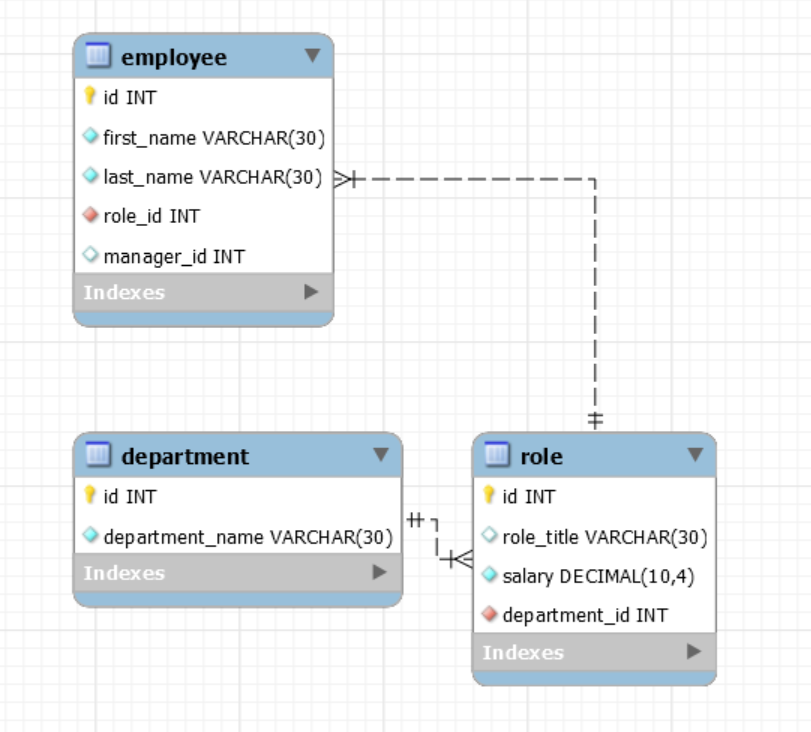

# Employee🐱‍👤 Tracker📝

## Description 🎫

Developers are often tasked with creating interfaces that make it easy for non-developers to view and interact with information stored in databases. Often these interfaces are known as **C**ontent **M**anagement **S**ystems. In this homework assignment, your challenge is to architect and build a solution for managing a company's employees using node, inquirer, and MySQL.

## To Deploy and Use Application📱💻
* install npm packages express, mysql, inquirer,Cfont-logo, and console.table
* add your mysql root password to the index.js file
* run node index.js to begin 

### Database Schema🔬💾

# What To Do 👁‍🗨👁‍🗨
Build a command-line application that at a minimum allows the user to:

  * Add departments, roles, employees

  * View departments, roles, employees

  * Update employee roles

Bonus points if you're able to:

  * Update employee managers

  * View employees by manager

  * Delete departments, roles, and employees

  * View the total utilized budget of a department -- ie the combined salaries of all employees in that department
  ------------------------------------------------------------------------------------------------------------------
## Video Link 📽
https://drive.google.com/file/d/15vtROeTAVzjcNqJLgdtuAuYlUf3DcO8g/view

## USER STORY 📖
 As a business owner
I want to be able to view and manage the departments, roles, and employees in my company
So that I can organize and plan my business 

## Here's some references that can help you understand the project✨:

* Use the [MySQL](https://www.npmjs.com/package/mysql) NPM package to connect to your MySQL database and perform queries.

* Use [InquirerJs](https://www.npmjs.com/package/inquirer/v/0.2.3) NPM package to interact with the user via the command-line.

* Use [console.table](https://www.npmjs.com/package/console.table) to print MySQL rows to the console. There is a built-in version of `console.table`, but the NPM package formats the data a little better for our purposes.

* You may wish to have a separate file containing functions for performing specific SQL queries you'll need to use. Could a constructor function or a class be helpful for organizing these?

* You will need to perform a variety of SQL JOINS to complete this assignment, and it's recommended you review the week's activities if you need a refresher on this.
